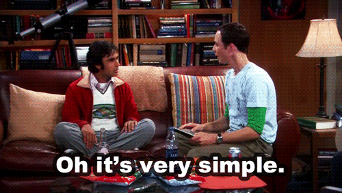

# Rock - Paper - Scissors - Lizard - Spock

(Piedra - Papel - Tijera - Lagarto - Spock)

Piedra, papel o tijera? No, no, no. Evidencia anecdótica sugiere que con 'Piedra, papel o tijera', los jugadores familiarizados entre sí empatarán del 75% al 80% de las veces, debido al limitado número de resultados. Te sugiero jugar en cambio a 'Piedra, Papel, Tijera, Lagarto, Spock'.

Es muy sencillo, mirá:

Tijera corta papel,
papel envuelve a piedra,
piedra aplasta a lagarto,
lagarto envenena a Spock,
Spock rompe tijera,
tijera decapita a lagarto,
lagarto devora papel,
papel refuta a Spock,
Spock vaporiza piedra,
Y como siempre: piedra aplasta tijera.

---

---

(Ejercicio desarrollado a partir del workshop 'Introducción a JavaScript – 26/05/2020' dictado por Ada ITW)
